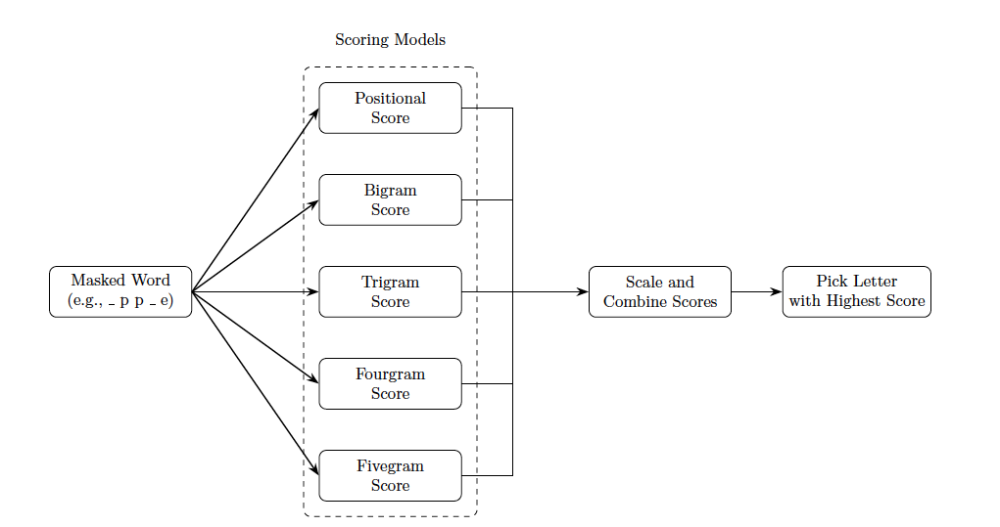

### 🧠 `LocalGuesserPositionUnigram` Letter Guessing Algorithm

The `LocalGuesserPositionUnigram` class implements a letter-guessing algorithm that combines positional *n*-gram statistics derived from a training dictionary to predict the next best letter guess.

At each step, the system accepts a masked word, computes a score for each possible letter based on the available information, and selects the letter with the highest score as its guess.

  
  
<em>Figure 1: Letter guessing class: the masked word is processed through multiple scoring models, their outputs are merged, and the scores are combined to predict the next best letter.</em>

The scoring model consists of the following components:

- **Positional Score**:  
  Estimates the likelihood of each letter based on its positional frequency within the set of training dictionary words that are compatible with the given masked word.

- **Bigram Score**:  
  Estimates the likelihood of each letter based on the revealed neighboring letters, using the frequency of two-letter sequences in the training set.

- **Trigram Score**:  
  Estimates the likelihood of each letter by examining patterns formed by (up to) two preceding or succeeding revealed letters and matching them with three-letter sequences in the training set.

- **Fourgram Score**:  
  Estimates the likelihood of each letter by examining patterns formed by (up to) three preceding or succeeding revealed letters and matching them with four-letter sequences in the training set.

- **Fivegram Score**:  
  Estimates the likelihood of each letter by examining patterns formed by (up to) four preceding or succeeding revealed letters and matching them with five-letter sequences in the training set.

All five models are **position-aware**: they consider the position of each letter both from the start and from the end of the word. Forward and backward position-based scores are computed separately and then combined.

Finally, the outputs from all five models are merged using a **weighted sum**, resulting in a final scoring vector used to select the best next letter to guess.
